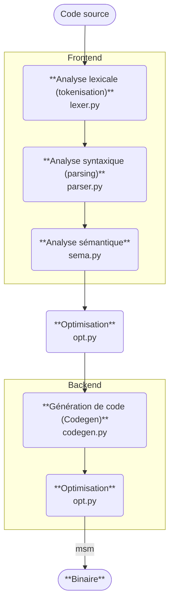

<!-- Github : https://github.com/AlexZeGamer/yacc -->

# YACC (Yet Another C Compiler)

> 
> Ne doit pas être confondu avec [Yet Another Compiler Compiler](https://en.wikipedia.org/wiki/Yacc).

> 
> English version: [README.md](./README.md)

**Yet Another C Compiler** est un compilateur simple pour un sous-ensemble du langage C, écrit en Python dans le cadre d’un cours de compilation en école d’ingénieurs. Il traduit du C en assembleur pour une machine à pile minimale (MSM).

## Table des matières

- [YACC (Yet Another C Compiler)](#yacc-yet-another-c-compiler)
  - [Table des matières](#table-des-matières)
  - [Pré-requis](#pré-requis)
  - [Installation](#installation)
  - [Utilisation](#utilisation)
    - [Paramètres](#paramètres)
    - [Utilisation avec le simulateur MSM](#utilisation-avec-le-simulateur-msm)
    - [Exemples](#exemples)
  - [Pipeline de compilation](#pipeline-de-compilation)
    - [Étapes de compilation](#étapes-de-compilation)
    - [Exemple pas à pas](#exemple-pas-à-pas)
  - [Auteur](#auteur)

## Pré-requis

- Python 3.10 ou plus récent
- GCC (pour compiler le [simulateur MSM](./msm/README.md))

## Installation

1. Cloner le dépôt :
    ```bash
    git clone https://github.com/AlexZeGamer/yacc.git
    cd yacc
    ```

2. *(optionnel)* Installer le projet comme paquet :
    ```bash
    pip install .
    ```

3. Compiler le simulateur MSM :
    ```bash
    cd msm
    gcc -o msm msm.c # ou 'make msm' si make est installé
    ```

4. *(optionnel)* Ajouter le simulateur MSM au PATH pour un accès rapide :
    ```bash
    # Linux / WSL
    export PATH="$PATH:$(pwd)/msm" # Ajouter cette ligne à ~/.bashrc
    ```
    
    ```powershell
    # Windows PowerShell
    $env:PATH += ";$PWD/msm" # Ajouter cette ligne au profil PowerShell
    ```

## Utilisation

```bash
python yacc.py <paramètres>
```
ou
```bash
yacc <paramètres> # si installé comme paquet
```

### Paramètres

Entrée :
- `input.c` ou `--i <input.c>` ou `--input <input.c>` : Fichier source à compiler
- `--str="<code_source>"` : Compiler un code source C depuis une chaîne fournie au lieu de lire un fichier
- `--stdin` : Lire le code source C depuis l’entrée standard (ex. via un pipe)

Sortie :
- `output.asm` ou `--o <output.asm>` ou `--output <output.asm>` : Fichier assembleur de sortie
- `--stdout` : Afficher le code assembleur généré sur la sortie standard (peut être redirigé vers le simulateur MSM, ex. `yacc input.c --stdout | ./msm/msm`)

Autres options :
- `-v` ou `--verbose` ou `--debug` : Mode verbeux pour détailler chaque [étape de compilation](#étapes-de-compilation)
- `-h` ou `--help` : Afficher l’aide

### Utilisation avec le simulateur MSM

>  
> *Consulter le [README du simulateur MSM](./msm/README.md) pour plus de détails sur le langage assembleur MSM et le simulateur.*

Pour utiliser le simulateur MSM, il est possible de rediriger directement la sortie du compilateur YACC vers le simulateur. Exemple :

```bash
yacc input.c --stdout | ./msm/msm
```
ou
```bash
yacc input.c --stdout | msm # si msm est dans le PATH
```

### Exemples
Compiler un fichier C vers un fichier assembleur :
```bash
yacc input.c -o output.asm
```

Compiler un fichier C et l’exécuter directement avec le simulateur MSM :
```bash
yacc input.c --stdout | msm
```

Compiler une chaîne de code C et l’exécuter directement avec le simulateur MSM :
```bash
yacc --str="int main() { return 42; }" --stdout | msm
```

Compiler un fichier C lu depuis l’entrée standard et l’exécuter directement avec le simulateur MSM :
```bash
cat input.c | yacc --stdin --stdout | msm
```

Compiler un fichier C avec une sortie verbeuse pour le débogage :
```bash
yacc input.c -o output.asm --verbose
```

## Pipeline de compilation

### Étapes de compilation

Le processus est composé des étapes suivantes (et implémenté par les fichiers suivants) :

1. **Analyse lexicale (tokenisation)** : [`lexer.py`](lexer.py)  
   Convertit le code source C en une liste de tokens représentant les plus petites unités de sens (mots-clés, identifiants, opérateurs, etc.)

2. **Analyse syntaxique (parsing)** : [`parser.py`](parser.py)  
   Parcourt la séquence de tokens pour construire un [arbre syntaxique abstrait (AST)](https://fr.wikipedia.org/wiki/Arbre_de_la_syntaxe_abstraite) représentant la structure du programme

3. **Analyse sémantique** : [`sema.py`](sema.py)  
   Vérifie l’AST pour détecter les erreurs sémantiques (déclarations, typage) et l’annoter avec des informations supplémentaires

4. **Optimisation** : [`opt.py`](opt.py)  
   Optimise l’AST pour améliorer les performances (ex. évaluation de constantes, élimination de code mort)

5. **Génération de code (Codegen)** : [`codegen.py`](codegen.py)  
   Génère le code assembleur cible à partir de l’AST optimisé

6. **Optimisation** : [`opt.py`](opt.py)  
   Optimise le code assembleur généré (ex. suppression d’instructions qui s'annulent mutuellement, etc.)

7. **Binaire** : *(réalisé par le simulateur MSM)*  
   Le code assembleur est interprété instruction par instruction pour exécuter le programme

<details>
<summary>Afficher le schéma</summary>


</details>

### Exemple pas à pas

1. **Code source** :
    ```c
    ...
    if (a == 3) {
        b = 5;
    }
    ...
    ```

2. **Analyse lexicale (tokenisation)** :
    ```
    ...
    TOK_IF           "if"
    TOK_LPARENTHESIS "("
    TOK_IDENT        "a"
    TOK_EQ           "=="
    TOK_CONST        "3"
    TOK_RPARENTHESIS ")"
    TOK_LBRACE       "{"
    TOK_IDENT        "a"
    TOK_AFFECT       "="
    TOK_CONST        "5"
    TOK_SEMICOLON    ";"
    TOK_RBRACE       "}"
    ...
    TOK_EOF
    ```

3. **Analyse syntaxique (génération de l’AST)** :
    ```
    NODE_BLOCK
    ...
    ├── NODE_COND
    │   ├── NODE_EQ
    │   │   ├── NODE_REF a
    │   │   └── NODE_CONST #3
    │   └── NODE_BLOCK
    │       └── NODE_DROP
    │           └── NODE_AFFECT
    │               ├── NODE_REF b
    │               └── NODE_CONST #5
    ...
    ```

4. **Analyse sémantique (vérification & annotation de l’AST)** :
    ```
    NODE_BLOCK
    ...
    ├── NODE_COND
    │   ├── NODE_EQ
    │   │   ├── NODE_REF a @0
    │   │   └── NODE_CONST #3
    │   └── NODE_BLOCK
    │       └── NODE_DROP
    │           └── NODE_AFFECT
    │               ├── NODE_REF b @1
    │               └── NODE_CONST #5
    ...
    ```

5. **Optimisation** :
    ```
    TODO
    ```

6. **Génération de code** :
    ```
    ...
    get 0
    push 3
    cmpeq
    jumpf L0_else
    push 5
    dup
    set 0
    drop 1
    .L0_else
    ...
    ```

7. **Optimisation** :
    ```
    TODO
    ```

8. **Binaire** :
    ```
    0101010101101000111010...
    ```

<details>
<summary>Afficher le schéma</summary>


</details>

```mermaid
graph TB
    right_CS("**Code source :**<code><p style='text-align:left; white-space:pre;'>...
    if (a == 3) {
         </tr>b=5;
    }
    ...</p></code>") --> right_AL

    right_AL("**Analyse lexicale<br>(Tokenisation) :**<code><p style='text-align:left;white-space:pre;'>...
    TOK_IF           &quot;if&quot;
    TOK_LPARENTHESIS &quot;(&quot;
    TOK_IDENT        &quot;a&quot;
    TOK_EQ           &quot;==&quot;
    TOK_CONST        &quot;3&quot;
    TOK_RPARENTHESIS &quot;)&quot;
    TOK_LBRACE       &quot;{&quot;
    TOK_IDENT        &quot;a&quot;
    TOK_AFFECT       &quot;=&quot;
    TOK_CONST        &quot;5&quot;
    TOK_SEMICOLON    &quot;;&quot;
    TOK_RBRACE       &quot;}&quot;
    ...
    TOK_EOF</p></code>") --> right_ASy

    right_ASy("**Analyse syntaxique<br>(Génération de l’AST) :**<code><p style='text-align:left;  white-space:pre;'>NODE_BLOCK
    ...
    ├── NODE_COND
    │   ├── NODE_EQ
    │   │   ├── NODE_REF a
    │   │   └── NODE_CONST #3
    │   └── NODE_BLOCK
    │       └── NODE_DROP
    │           └── NODE_AFFECT
    │               ├── NODE_REF b
    │               └── NODE_CONST #5
    ...</p></code>") --> right_ASe

    right_ASe("**Analyse sémantique<br>(Vérification & annotation) :**<code><p style='text-align:left;white-space:pre;'>NODE_BLOCK
    ...
    ├── NODE_COND
    │   ├── NODE_EQ
    │   │   ├── NODE_REF a @0
    │   │   └── NODE_CONST #3
    │   └── NODE_BLOCK
    │       └── NODE_DROP
    │           └── NODE_AFFECT
    │               ├── NODE_REF b @1
    │               └── NODE_CONST #5
    ...</p></code>") --> right_Opt

    right_Opt("**Optimisation :**<code><p style='text-align:left;white-space:pre;'>TODO</p></code>") --> right_GC

    right_GC("**Génération de code :**<code><p style='text-align:left;white-space:pre;'>...
    get 0
    push 3
    cmpeq
    jumpf L0_else
    push 5
    dup
    set 0
    drop 1
    .L0_else
    ...</p></code>") --> right_Opt2

    right_Opt2("**Optimisation :**<code><p style='text-align:left;white-space:pre;'>TODO</p></code>") -- msm --> right_Bin

    right_Bin(["**Binaire :**<code><p style='text-align:left;'>0101010101101000111010...</p></code>"])
```

## Auteur

<table>
  <tr>
    <td></td>
    <td>Alexandre MALFREYT (<a href="https://github.com/AlexZeGamer">Github</a> | <a href="https://www.linkedin.com/in/alexandre-malfreyt/">LinkedIn</a> | <a href="https://alexandre.malfre.yt">Site web</a>)</td>
  </tr>
</table>