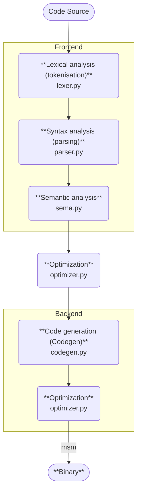

<!-- Github : https://github.com/AlexZeGamer/yacc -->

# YACC (Yet Another C Compiler)

> 
> Not to be confused with [Yet Another Compiler Compiler](https://en.wikipedia.org/wiki/Yacc) *(which I learned about only after naming this project...)*

> 
> Version française : [README-fr.md](./README-fr.md)

**Yet Another C Compiler** is a simple compiler for a subset of the C programming language, written in Python, in the context of a compilation course in engineering school. It translates C code into assembly code for a minimal stack machine (MSM).

## Table of Contents

- [YACC (Yet Another C Compiler)](#yacc-yet-another-c-compiler)
  - [Table of Contents](#table-of-contents)
  - [Requirements](#requirements)
  - [Installation](#installation)
  - [Usage](#usage)
    - [Parameters](#parameters)
    - [Usage with the MSM simulator](#usage-with-the-msm-simulator)
    - [Examples](#examples)
    - [Testing](#testing)
  - [Compilation Pipeline](#compilation-pipeline)
    - [Compilation Steps](#compilation-steps)
    - [Step by Step Example](#step-by-step-example)
  - [Author](#author)

## Requirements

- Python 3.10 or higher
- GCC (for compiling the [MSM simulator](./msm/README.md))

## Installation

1. Clone the repository:
    ```bash
    git clone https://github.com/AlexZeGamer/yacc.git
    cd yacc
    ```

2. *(optional)* Install the project as a package:
    ```bash
    pip install .
    ```

3. Compile the MSM simulator:
    ```bash
    cd msm
    gcc -o msm msm.c # or 'make msm' if make is installed
    ```

4. *(optional)* Add the MSM simulator to your PATH for easy access:
    ```bash
    # Linux / WSL
    export PATH="$PATH:$(pwd)/msm" # Add this line to ~/.bashrc
    ```
    
    ```powershell
    # Windows PowerShell
    $env:PATH += ";$PWD/msm" # Add this line to your PowerShell profile
    ```

## Usage

```bash
python yacc.py <parameters>
```
or
```bash
yacc <parameters> # if installed as a package
```

### Parameters

Input :
- `input.c` or `--i <input.c>` or `--input <input.c>`: Source file to compile
- `--str="<source_code>"`: Instead of reading from a file, compile the provided C source code string
- `--stdin`: Read the C source code from standard input (e.g. via a pipe)

Output :
- `output.asm` or `--o <output.asm>` or `--output <output.asm>`: Output assembly file
- `--stdout`: Print the generated assembly code to standard output instead of writing to a file (you can pipe it to the MSM simulator to run it directly, e.g. `yacc input.c --stdout | ./msm/msm`)

Other options :
- `-v` or `--verbose` or `--debug`: Enable verbose mode for detailed output of every [compilation step](#Compilation_Steps)
- `-h` or `--help`: Show help message

### Usage with the MSM simulator

>  
> *See the [MSM simulator README](./msm/README.md) for more details about the MSM assembly language and simulator.*

To use the MSM simulator, you can pipe the output of the YACC compiler directly into the simulator. For example:

```bash
yacc input.c --stdout | ./msm/msm
```
or
```bash
yacc input.c --stdout | msm # if msm is in your PATH
```

### Examples
Compile a C source file to an assembly file:
```bash
yacc input.c -o output.asm
```

Compile a C source file and run it directly with the MSM simulator:
```bash
yacc input.c --stdout | msm
```

Compile a C source code string and run it directly with the MSM simulator:
```bash
yacc --str="int main() { return 42; }" --stdout | msm
```

Compile a C source file read from standard input and run it directly with the MSM simulator:
```bash
cat input.c | yacc --stdin --stdout | msm
```

Compile a C source file with verbose output for debugging:
```bash
yacc input.c -o output.asm --verbose
```

## Testing

Install the test runner once (for example with `python -m pip install pytest`) and execute the suite from the repository root:

```bash
python -m pytest
```

You can also target a single pipeline step by pointing pytest at the matching file, e.g. `python -m pytest tests/test_parser.py` to limit the run to parser tests.

## Compilation Pipeline

### Compilation Steps

The compilation process consists of the following steps (and implemented in the following files):

1. **Lexical analysis (tokenisation)**: [`lexer.py`](src/yacc/lexer.py)  
   Converts the input C source code into a list of tokens representing the smallest units of meaning (keywords, identifiers, operators, etc.)

2. **Syntax analysis (parsing)**: [`parser.py`](src/yacc/parser.py)  
   Parses the sequence of tokens to build an [Abstract Syntax Tree (AST)](https://en.wikipedia.org/wiki/Abstract_syntax_tree) representing the program structure

3. **Semantic analysis**: [`sema.py`](src/yacc/sema.py)  
   Analyzes the AST to check for semantic errors (e.g., variable declarations, type checking) and annotates the AST with additional information

4. **Optimization**: [`optimizer.py`](src/yacc/optimizer.py)  
   Performs optimizations on the AST to improve performance (e.g., constant folding, dead code elimination)

5. **Code generation (Codegen)**: [`codegen.py`](src/yacc/codegen.py)  
   Generates the target assembly code from the optimized AST

6. **Optimization**: [`optimizer.py`](src/yacc/optimizer.py)  
   Performs optimizations on the generated assembly code to improve performance (e.g., removing instructions that cancel each other out, etc.)

7. **Binary**: *(This step is done by the MSM simulator)*  
   The generated assembly code is interpreted line by line to run the program

<details>
<summary>Show diagram</summary>


</details>

### Step by Step Example

1. **Source code**:
    ```c
    ...
    if (a == 3) {
        b = 5;
    }
    ...
    ```

2. **Lexical analysis (tokenisation)**:
    ```
    ...
    TOK_IF           "if"
    TOK_LPARENTHESIS "("
    TOK_IDENT        "a"
    TOK_EQ           "=="
    TOK_CONST        "3"
    TOK_RPARENTHESIS ")"
    TOK_LBRACE       "{"
    TOK_IDENT        "a"
    TOK_AFFECT       "="
    TOK_CONST        "5"
    TOK_SEMICOLON    ";"
    TOK_RBRACE       "}"
    ...
    TOK_EOF
    ```

3. **Syntax analysis (AST generation)**:
    ```
    NODE_BLOCK
    ...
    ├── NODE_COND
    │   ├── NODE_EQ
    │   │   ├── NODE_REF a
    │   │   └── NODE_CONST #3
    │   └── NODE_BLOCK
    │       └── NODE_DROP
    │           └── NODE_AFFECT
    │               ├── NODE_REF b
    │               └── NODE_CONST #5
    ...
    ```

4. **Semantic analysis (AST verification & annotation)**:
    ```
    NODE_BLOCK
    ...
    ├── NODE_COND
    │   ├── NODE_EQ
    │   │   ├── NODE_REF a @0
    │   │   └── NODE_CONST #3
    │   └── NODE_BLOCK
    │       └── NODE_DROP
    │           └── NODE_AFFECT
    │               ├── NODE_REF b @1
    │               └── NODE_CONST #5
    ...
    ```

5. **Optimization**:
    ```
    TODO
    ```

6. **Code generation**:
    ```
    ...
    get 0
    push 3
    cmpeq
    jumpf L0_else
    push 5
    dup
    set 0
    drop 1
    .L0_else
    ...
    ```

7. **Optimization**:
    ```
    TODO
    ```

8. **Binary**:
    ```
    0101010101101000111010...
    ```

<details>
<summary>Show diagram</summary>


</details>

```mermaid
graph TB
    right_CS("**Source code :**<code><p style='text-align:left; white-space:pre;'>...
    if (a == 3) {
         </tr>b=5;
    }
    ...</p></code>") --> right_AL

    right_AL("**Lexic analyzer<br>(Tokenization) :**<code><p style='text-align:left;white-space:pre;'>...
    TOK_IF           &quot;if&quot;
    TOK_LPARENTHESIS &quot;(&quot;
    TOK_IDENT        &quot;a&quot;
    TOK_EQ           &quot;==&quot;
    TOK_CONST        &quot;3&quot;
    TOK_RPARENTHESIS &quot;)&quot;
    TOK_LBRACE       &quot;{&quot;
    TOK_IDENT        &quot;a&quot;
    TOK_AFFECT       &quot;=&quot;
    TOK_CONST        &quot;5&quot;
    TOK_SEMICOLON    &quot;;&quot;
    TOK_RBRACE       &quot;}&quot;
    ...
    TOK_EOF</p></code>") --> right_ASy

    right_ASy("**Syntax analysis<br>(AST generation) :**<code><p style='text-align:left;  white-space:pre;'>NODE_BLOCK
    ...
    ├── NODE_COND
    │   ├── NODE_EQ
    │   │   ├── NODE_REF a
    │   │   └── NODE_CONST #3
    │   └── NODE_BLOCK
    │       └── NODE_DROP
    │           └── NODE_AFFECT
    │               ├── NODE_REF b
    │               └── NODE_CONST #5
    ...</p></code>") --> right_ASe

    right_ASe("**Semantic analysis<br>(AST verification & annotation) :**<code><p style='text-align:left;white-space:pre;'>NODE_BLOCK
    ...
    ├── NODE_COND
    │   ├── NODE_EQ
    │   │   ├── NODE_REF a @0
    │   │   └── NODE_CONST #3
    │   └── NODE_BLOCK
    │       └── NODE_DROP
    │           └── NODE_AFFECT
    │               ├── NODE_REF b @1
    │               └── NODE_CONST #5
    ...</p></code>") --> right_Opt

    right_Opt("**Optimization :**<code><p style='text-align:left;white-space:pre;'>TODO</p></code>") --> right_GC

    right_GC("**Code generation :**<code><p style='text-align:left;white-space:pre;'>...
    get 0
    push 3
    cmpeq
    jumpf L0_else
    push 5
    dup
    set 0
    drop 1
    .L0_else
    ...</p></code>") --> right_Opt2

    right_Opt2("**Optimization :**<code><p style='text-align:left;white-space:pre;'>TODO</p></code>") -- msm --> right_Bin

    right_Bin(["**Binary :**<code><p style='text-align:left;'>0101010101101000111010...</p></code>"])
```

## Author

<table>
  <tr>
    <td></td>
    <td>Alexandre MALFREYT (<a href="https://github.com/AlexZeGamer">Github</a> | <a href="https://www.linkedin.com/in/alexandre-malfreyt/">LinkedIn</a> | <a href="https://alexandre.malfre.yt">Website</a>)</td>
  </tr>
</table>
